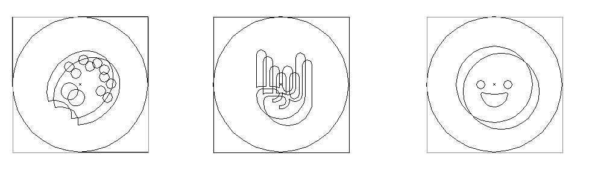

Projeto de Landing Page para anuncio das vagas em aberto da Elo7.

## Etapas do Desenovlvimento do Projeto

1. Criação do Repositório ✔
2. Pareamento do Versionamento ✔
3. Criação da Estrutura ✔
4. Tratamento das imagens ✔
5. Configuração do Gulp para Deploy do SASS, JS, IMAGENS e HTML ✔
6. Criação da Estrutura HTML ✔
7. Estilização Mobile ✔
8. Estilização Desktop ✔
9. Implementação do JS para consulta no servidor via Ajax ✔
10. Preencher os dados na página ✔
11. Criação do Servidor Node
12. Criação de teste Jasmine simples

### Tratamento das imagens
Foi necessário tratar algumas imagens para deixa-las menores e assim ganhar performace no carregamento da página.

Algumas imagens, foram transformadas em SVG para ganhar maior qualidade e melhorar a velocidade ainda mais no carregamento da página.

